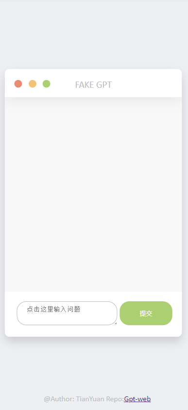

# GPT3-WEB
#### 这是一个代理GPT3的API实现，可以用来生成文本.基于[go-gpt3](https://github.com/sashabaranov/go-gpt3)实现
#### 这并不是大火的 (~~CHATGPT3~~)❌，因为CHATGPT3的 ***API*** 尚未开放

### 项目结构
```
├── README.md
├── key.config  存储openai-key的配置文件
├── go.mod
├── go.sum
├── main.go     主程序
├── static      前端文件
│   ├── index.html
│   ├── css/
│   ├── img/
│   └── js/          前端js文件,用于向后端发送ws请求与调整动画
└── src              后端文件
    ├── handleWS.go  处理WS请求
    └── Route.go     路由
```
注意： ker.config文件中的key需要自己去[openai](https://openai.com/)申请,并且需要将key填入其中,否则无法使用。
同时key.config需要和可执行文件在同一目录下！！

前端文件[webSocket.js](static/js/webSocket.js)中的```ws = new WebSocket("ws://localhost:8080/ws");```需要修改为你的服务器地址
### 使用方法(你可以直接下载二进制文件使用)❌明天再改
#### 1. 安装依赖
```
go mod download
```
#### 2. 编译
```
go build main.go
```
#### 3. 运行
```
./main
```

如果KEY不起作用，你可以尝试在[handleWS.go](src/handleWS.go)中将 ```client := gogpt.NewClient(key) ```中的key指定为字符串```client := gogpt.NewClient("*******") ```

### 项目截图

### 本项目仅供学习交流使用，不得用于商业用途